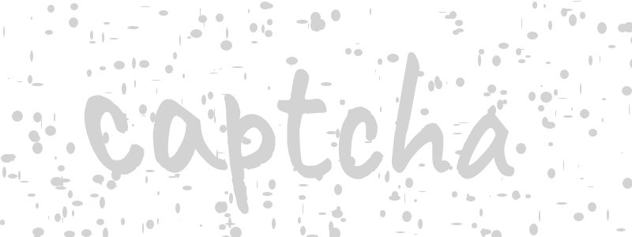
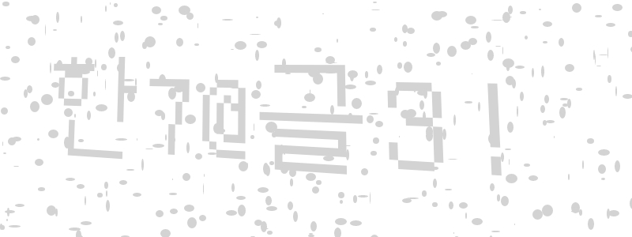

# Getting Started

This page will guide you through generating your first CAPTCHA image.

OpenCaptcha uses a single endpoint:

```
POST https://api.opencaptcha.io/captcha
```

By sending a POST request with some basic parameters, you can receive a custom CAPTCHA image in response.

---

## Step 1: Make a Basic Request

Below is a minimal example of how to call OpenCaptcha to generate a CAPTCHA.



[](https://hoppscotch.io/?method=POST&url=https%3A%2F%2Fapi.opencaptcha.io%2Fcaptcha&bodyMode=raw&contentType=application%2Fjson&rawParams=%7B%22text%22%3A%22captcha%22%7D)

<details>
<summary>View cURL request</summary>

```bash
curl -X 'POST' \
  'https://api.opencaptcha.io/captcha' \
  -H 'Content-Type: application/json' \
  -d '{
    "text": "captcha"
  }'
```
</details>

---

## Step 2: Explore Multilingual CAPTCHAs

OpenCaptcha supports various languages so you can use Chinese, Arabic and many other languages.



[](https://hoppscotch.io/?method=POST&url=https%3A%2F%2Fapi.opencaptcha.io%2Fcaptcha&bodyMode=raw&contentType=application%2Fjson&rawParams=%7B%22text%22%3A%22%E6%99%AE%E9%80%9A%22%7D)

<details>
<summary>View cURL request</summary>

```bash
curl -X 'POST' \
  'https://api.opencaptcha.io/captcha' \
  -H 'Content-Type: application/json' \
  -d '{
    "text": "普通"
  }'
```
</details>

---

## Step 3: Adjust Your Parameters

OpenCaptcha supports four main parameters: `text`, `width`, `height`, and `difficulty`. Here's how they work:

| Field            | Type      | Required | Description                                                                                 |
|------------------|-----------|----------|---------------------------------------------------------------------------------------------|
| **`text`**       | `string`  | **Yes**  | The text to display in the CAPTCHA image.                                                   |
| **`width`**      | `integer` | No       | The width of the generated image in pixels (default: **400**).                              |
| **`height`**     | `integer` | No       | The height of the generated image in pixels (default: **100**).                             |
| **`difficulty`** | `integer` | No       | The difficulty level of CAPTCHA distortion.<br/><br/>Possible values: 0, 1, 2, 3 (default: **1**). |

- **`text`** (Required)  
  Provide the text you want to appear in the CAPTCHA. If this field is omitted, the request is invalid.

- **`width`** and **`height`** (Optional)  
  Set your custom dimensions. If these are left as `null`, the defaults (400×100) are used.

- **`difficulty`** (Optional)
  - **0** – Easiest (minimal distortion)
  - **1** – Basic distortion (default)
  - **2** – Moderate distortion
  - **3** – Most challenging (heaviest distortion)

  If set to `null`, difficulty **1** is used.

---

## Step 4: Understand the Responses

OpenCaptcha returns a **JPEG** image upon success, or an error status if something goes wrong:

| HTTP Status                   | Description                                                                                    |
|------------------------------:|:-----------------------------------------------------------------------------------------------|
| **200 OK**                   | Returns the generated CAPTCHA image (JPEG) in the response body.                               |
| **400 Bad Request**          | The request is invalid (for example, missing or malformed parameters).                         |
| **500 Internal Server Error** | An unexpected error occurred on the server side.                                               |

---
